# Documentation Architecture - TP CI/CD

## PARTIE 1 : Modélisation

---

## 1.1 Diagramme de Cas d'Utilisation (Use Case)

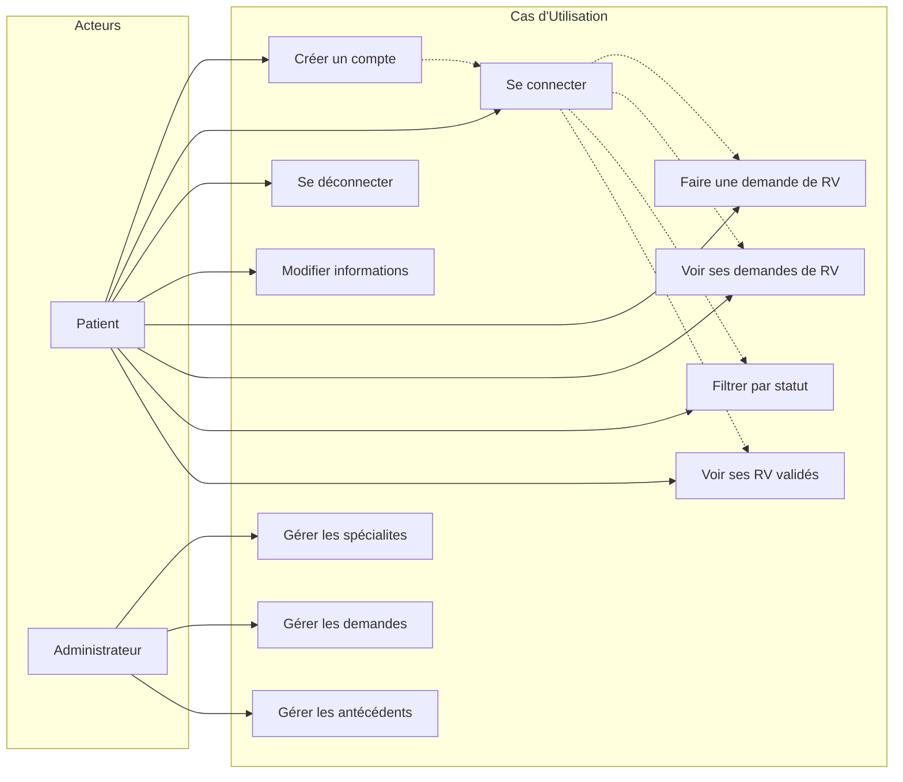

### Description des Cas d'Utilisation

| Cas | Description |
|-----|-------------|
| **Créer un compte** | Le patient s'inscrit avec ses informations personnelles |
| **Se connecter** | Le patient s'authentifie avec email/mot de passe |
| **Faire une demande de RV** | Le patient demande un rendez-vous (date, heure, spécialité) |
| **Voir ses demandes** | Le patient consulte la liste de ses demandes |
| **Filtrer par statut** | Le patient filtre ses demandes (En attente, Validé, Refusé) |
| **Voir ses RV** | Le patient voit ses rendez-vous validés |

---

## 1.2 Diagramme de Classes UML

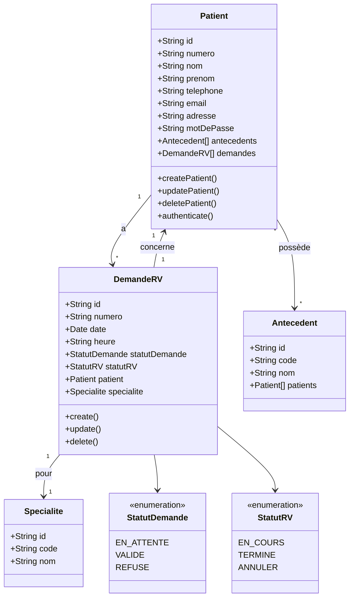

### Cardinalités

| Relation | Cardinalité | Description |
|----------|-------------|-------------|
| Patient → DemandeRV | 1..* | Un patient peut avoir plusieurs demandes |
| DemandeRV → Patient | 1 | Une demande appartient à un patient |
| Patient → Antecedent | *..* | Un patient peut avoir plusieurs antécédents |
| DemandeRV → Specialite | 1 | Une demande concerne une spécialité |

---

## 1.3 Diagrammes d'Activité

### 1.3.1 Cas d'utilisation : Créer un compte

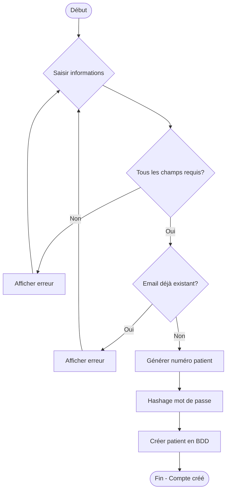

### 1.3.2 Cas d'utilisation : Faire une demande de RV

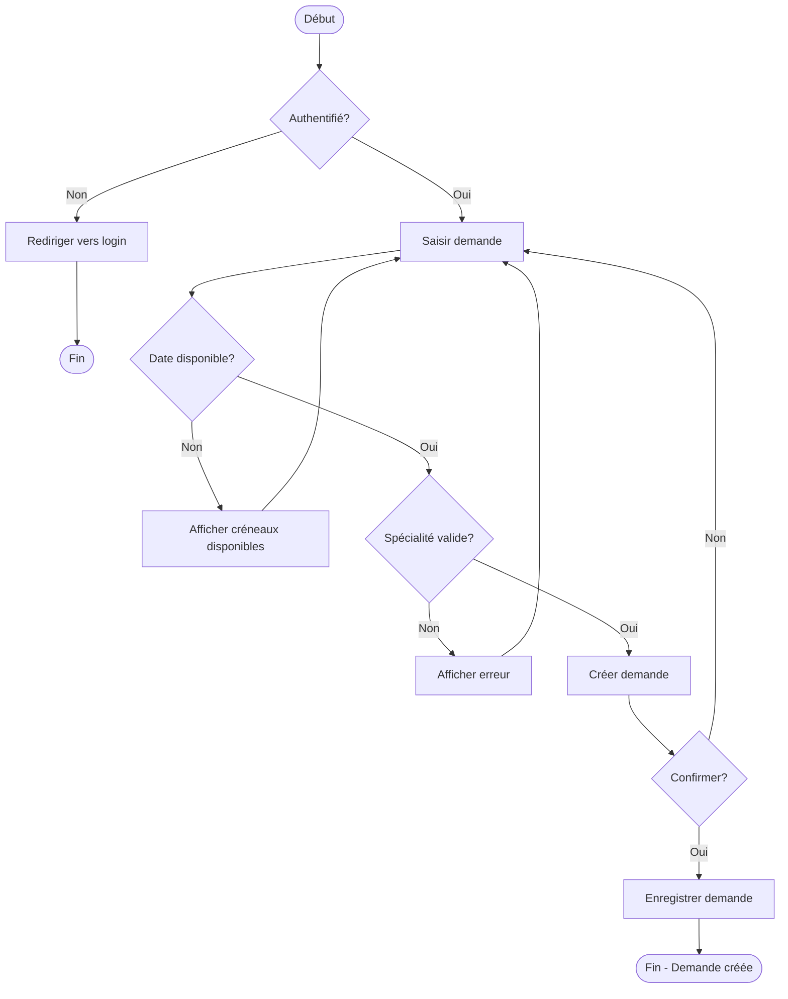

### 1.3.3 Cas d'utilisation : Se connecter

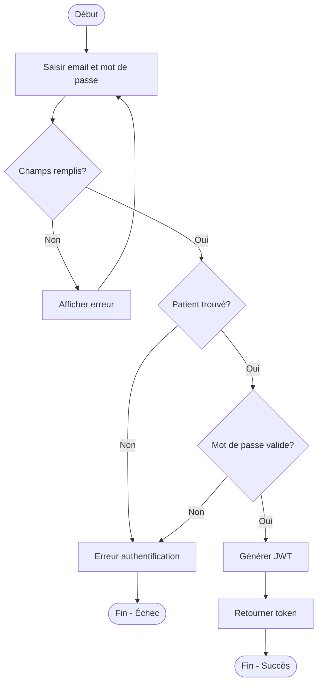

### 1.3.4 Cas d'utilisation : Filtrer les demandes par statut

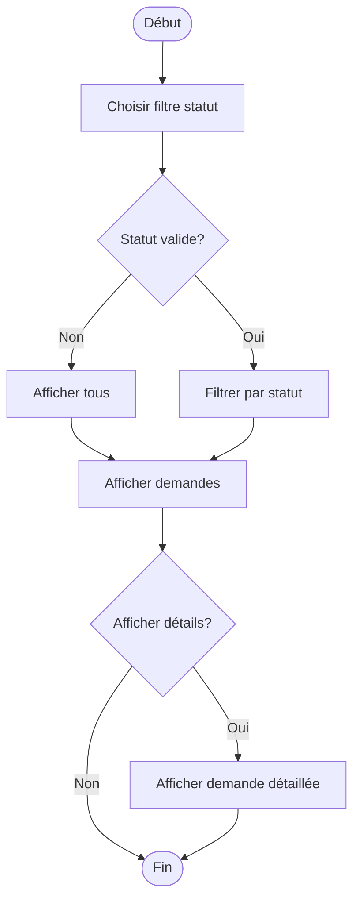

---

## 1.4 Maquettes de l'Application

### 1.4.1 Page d'Inscription

```
┌─────────────────────────────────────────┐
│         🏥 Gestion Rendez-vous           │
├─────────────────────────────────────────┤
│                                         │
│     ┌─────────────────────────────┐    │
│     │      Créer un compte         │    │
│     └─────────────────────────────┘    │
│                                         │
│     Nom:     [_______________]          │
│                                         │
│     Prénom:  [_______________]          │
│                                         │
│     Email:   [_______________]          │
│                                         │
│     Tél:     [_______________]          │
│                                         │
│     Mot de passe: [_______________]     │
│                                         │
│     Adresse: [_______________]          │
│                                         │
│     ┌─────────────────────────────┐    │
│     │      S'inscrire              │    │
│     └─────────────────────────────┘    │
│                                         │
│     Déjà un compte? Connexion           │
└─────────────────────────────────────────┘
```

### 1.4.2 Page de Connexion

```
┌─────────────────────────────────────────┐
│         🏥 Gestion Rendez-vous           │
├─────────────────────────────────────────┤
│                                         │
│     ┌─────────────────────────────┐    │
│     │      Connexion               │    │
│     └─────────────────────────────┘    │
│                                         │
│     Email:   [_______________]          │
│                                         │
│     Mot de passe: [_______________]     │
│                                         │
│     ┌─────────────────────────────┐    │
│     │       Se connecter           │    │
│     └─────────────────────────────┘    │
│                                         │
│     Pas de compte? Inscription          │
└─────────────────────────────────────────┘
```

### 1.4.3 Tableau de Bord Patient

```
┌────────────────────────────────────────────────────────────┐
│  🏥 Gestion Rendez-vous         Bienvenue, Jean Dupont  [↩]│
├────────────────────────────────────────────────────────────┤
│                                                            │
│  ┌──────────┐ ┌──────────┐ ┌──────────┐ ┌──────────┐      │
│  │ Mes RV   │ │ Demandes │ │ Profil   │ │ Déconnex.│      │
│  │  En cours│ │  En att. │ │          │ │          │      │
│  │    2     │ │    1     │ │          │ │          │      │
│  └──────────┘ └──────────┘ └──────────┘ └──────────┘      │
│                                                            │
│  ┌────────────────────────────────────────────────────┐   │
│  │  Filtrer par: [En attente ▼]  [Nouvelle demande] │   │
│  └────────────────────────────────────────────────────┘   │
│                                                            │
│  ┌────────────────────────────────────────────────────┐   │
│  │ # │ Date       │ Heure │ Spécialité    │ Statut    │   │
│  ├────────────────────────────────────────────────────┤   │
│  │ 1 │ 15/04/2026 │ 10:00 │ Cardiologie   │ Validé    │   │
│  │ 2 │ 16/04/2026 │ 14:30 │ Générale      │ En attente│   │
│  │ 3 │ 20/04/2026 │ 09:00 │ Dermatologie  │ Validé    │   │
│  └────────────────────────────────────────────────────┘   │
│                                                            │
└────────────────────────────────────────────────────────────┘
```

---

## 1.5 Architecture MVC

### 1.5.1 Documentation de l'Architecture MVC

L'architecture **MVC (Model-View-Controller)** sépare l'application en trois couches distinctes :

| Couche | Responsabilité | Exemple |
|--------|---------------|---------|
| **Model** | Données et logique métier | `Patient`, `DemandeRV` |
| **View** | Présentation (DTOs) | `PatientResponseDto` |
| **Controller** | Gestion des requêtes HTTP | `PatientController` |

### 1.5.2 Diagramme de Séquence MVC

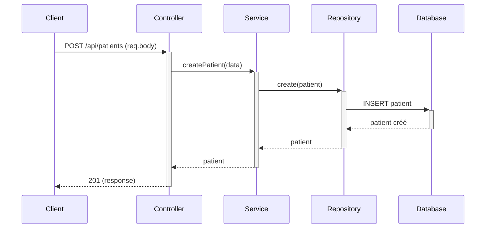

### 1.5.3 Flux MVC Complet

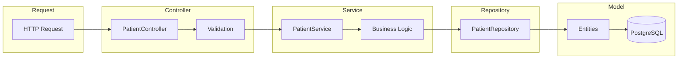

---

## 1.6 Pattern Repository

### 1.6.1 Documentation de l'Architecture Repository

Le pattern **Repository** abstrait la couche d'accès aux données :

| Avantage | Description |
|----------|-------------|
| **Découplage** | Le code métier ne connaît pas la source de données |
| **Testabilité** | Facile à mock pour les tests unitaires |
| **Maintenabilité** | Changement de BDD sans impact sur la logique métier |

### 1.6.2 Diagramme de Séquence Repository

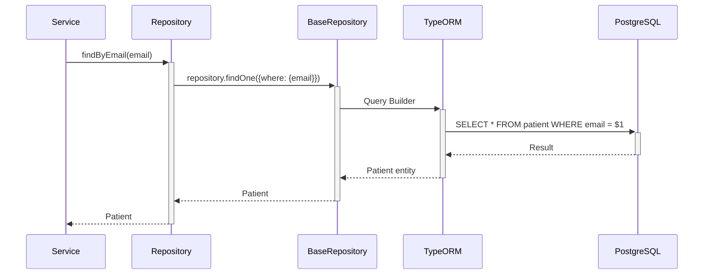

### 1.6.3 Structure du Repository

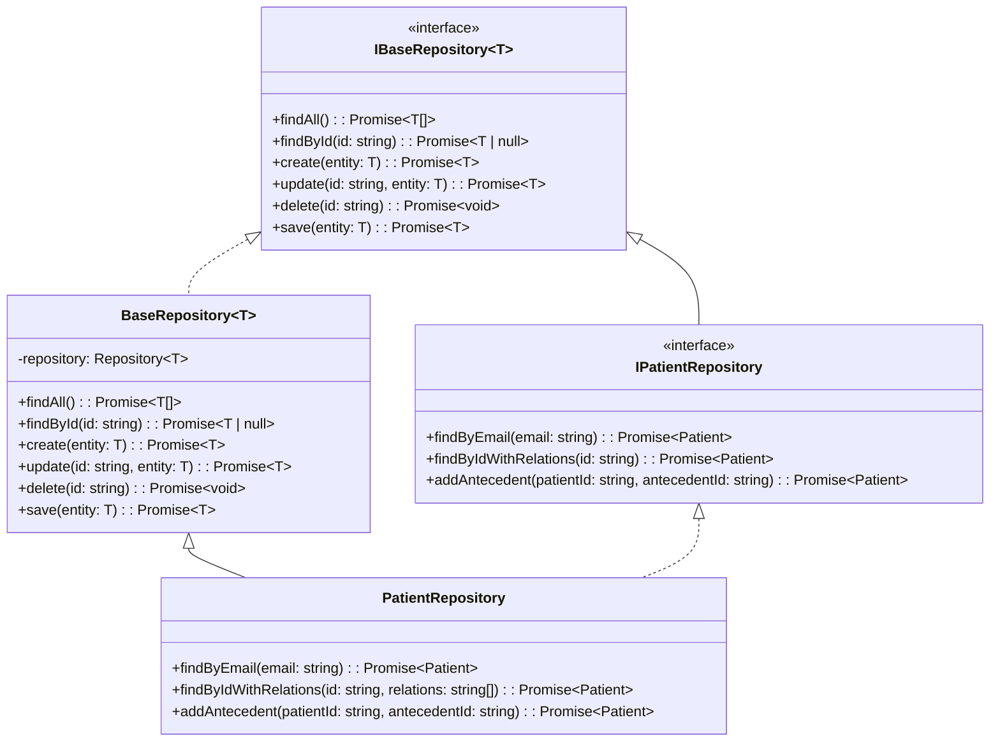

---

## 1.7 Schéma d'Architecture Globale (API REST)

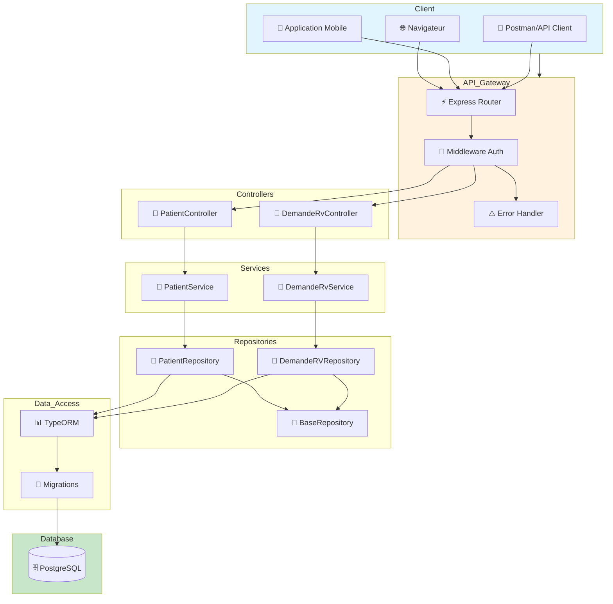

### Architecture API REST - Ressources

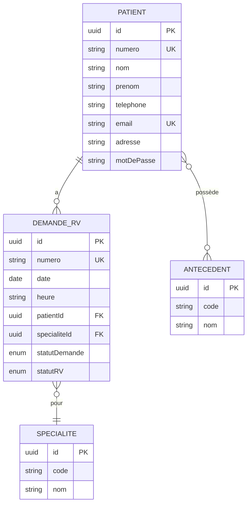

---

## 1.8 Principes SOLID et Design Patterns

### 1.8.1 Principes SOLID Appliqués

| Principe | Application dans le projet |
|----------|---------------------------|
| **S**ingle Responsibility | `PatientController` uniquement pour HTTP, `PatientService` pour la logique métier |
| **O**pen/Closed | Les repositories peuvent être étendus sans modification du service |
| **L**iskov Substitution | `PatientRepository` peut remplacer `IPatientRepository` |
| **I**nterface Segregation | Interfaces spécifiques par entité (`IPatientRepository`, `IDemandeRVRepository`) |
| **D**ependency Inversion | Les services dépendent des interfaces, pas des implémentations |

### 1.8.2 Design Patterns Utilisés

#### Pattern Repository

**Problème résolu :** Comment accéder aux données sans coupler le code métier à la base de données ?

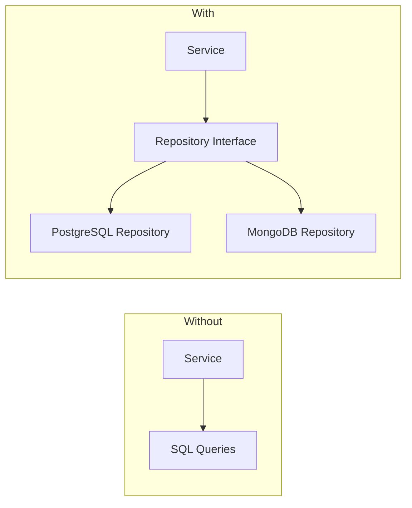

#### Pattern Builder

**Problème résolu :** Comment créer des objets complexes avec de nombreux paramètres ?

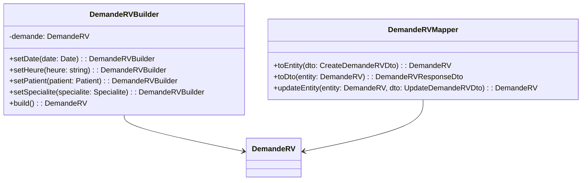

**Exemple d'utilisation :**

```typescript
// Sans Builder
const demande = new DemandeRV();
demande.date = new Date();
demande.heure = '10:00';
demande.patient = patient;
demande.specialite = specialite;

// Avec Builder
const demande = new DemandeRVBuilder()
  .setDate(new Date())
  .setHeure('10:00')
  .setPatient(patient)
  .setSpecialite(specialite)
  .build();
```

#### Pattern Mapper

**Problème résolu :** Comment convertir entre DTO et Entity sans polluer le code ?

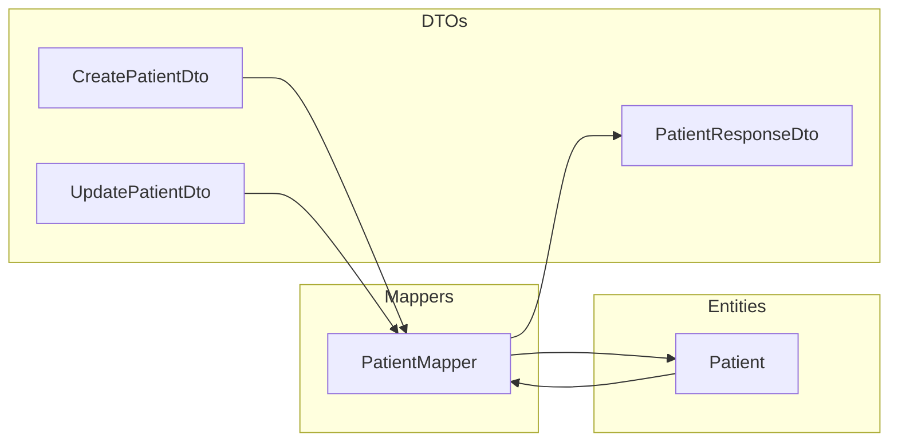

#### Pattern Singleton (Base de données)

**Problème résolu :** Comment s'assurer qu'une seule connexion à la base de données est créée ?

```typescript
// BaseRepository.ts
export class BaseRepository<T> {
  protected repository: Repository<T>; // Unique instance par entité

  constructor(entityClass: any) {
    // AppDataSource.getRepository() retourne toujours la même instance
    this.repository = AppDataSource.getRepository<T>(entityClass);
  }
}
```

### 1.8.3 Diagramme de Séquence - Design Patterns

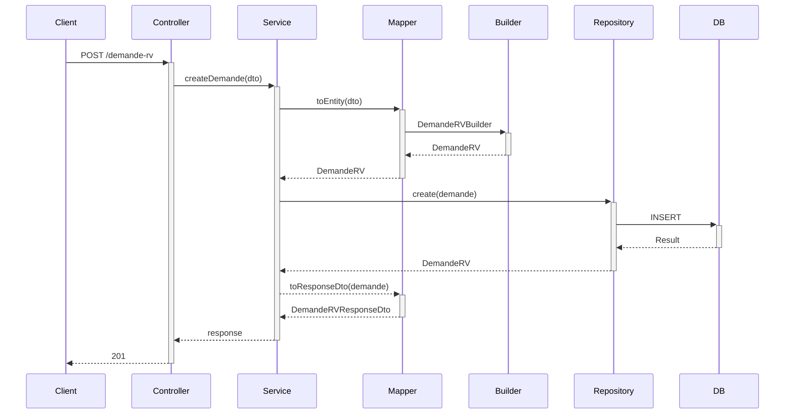

---

## 1.9 Architecture Monolithique

### Pourquoi une Architecture Monolithique ?

| Critère | Choix |
|---------|-------|
| **Complexité** | Projet de taille moyenne, pas besoin de microservices |
| **Déploiement** | Un seul artefact à déployer |
| **Performance** | Pas de latence réseau inter-services |
| **Coût** | Infrastructure simple et économique |

### Avantages

- ✅ Développement simple
- ✅ Déploiement uncomplicated
- ✅ Tests facilités (pas de mocks inter-services)
- ✅ Performance optimale pour les opérations ACID
- ✅ Équipe réduite

### Inconvénients

- ❌ Difficulté à faire évoluer (code spaghetti)
- ❌ Déploiement atomique (tout redéployer)
- ❌ Scaling vertical uniquement
- ❌ Couplage fort entre modules

### Alternative Future

Pour une application à plus grande échelle :

```
┌─────────────┐     ┌─────────────┐     ┌─────────────┐
│  Gateway    │────▶│  Patient    │────▶│  PostgreSQL │
│   API       │     │   Service   │     │             │
└─────────────┘     └─────────────┘     └─────────────┘
                           │
                           ▼
                    ┌─────────────┐     ┌─────────────┐
                    │  DemandeRV  │────▶│  PostgreSQL │
                    │   Service   │     │             │
                    └─────────────┘     └─────────────┘
```

---

## 1.10 Résumé de l'Architecture

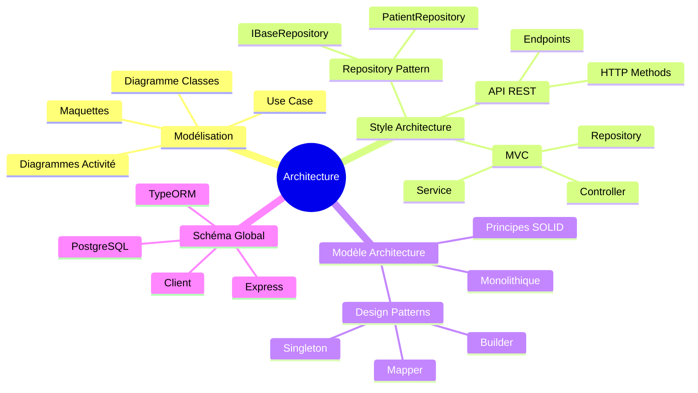
