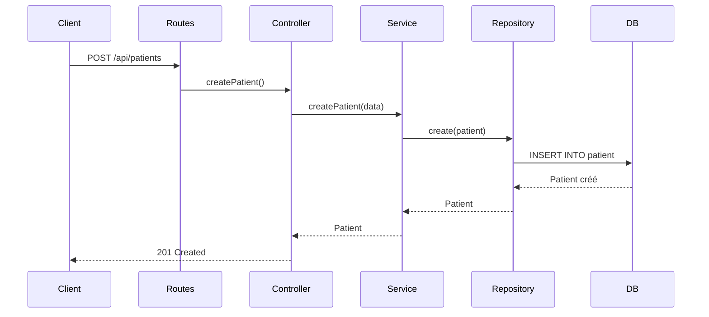

# 📚 Guide Complet du Projet - TP CI/CD Gestion de RV Médical

## Table des Matières

1. [Introduction](#1-introduction)
2. [Prérequis](#2-prérequis)
3. [Installation du Projet](#3-installation-du-projet)
4. [Architecture du Projet](#4-architecture-du-projet)
5. [Structure des Fichiers](#5-structure-des-fichiers)
6. [Explication des Composants](#6-explication-des-composants)
7. [Git & GitHub](#7-git--github)
8. [GitHub Actions - CI](#8-github-actions---ci)
9. [GitHub Actions - CD](#9-github-actions---cd)
10. [Tests Automatisés](#10-tests-automatisés)
11. [ESLint - Analyse de Code](#11-eslint---analyse-de-code)
12. [Déploiement avec Tags](#12-déploiement-avec-tags)
13. [Commandes Utiles](#13-commandes-utiles)
14. [FAQ - Questions Fréquentes](#14-faq---questions-fréquentes)

---

## 1. Introduction

### 1.1 Qu'est-ce qu'une API REST ?

Une **API REST** (Representational State Transfer) est un style d'architecture pour créer des services web. Elle utilise le protocole HTTP pour communiquer.

```
Client (Navigateur/Postman)  →  HTTP Request  →  API REST  →  Base de Données
Client (Navigateur/Postman)  ←  HTTP Response  ←  API REST  ←  Base de Données
```

### 1.2 Qu'est-ce que le CI/CD ?

| Concept | Description | Exemple |
|---------|-------------|---------|
| **CI** (Continuous Integration) | Intégrer le code automatiquement à chaque modification | Lint + Tests sur push |
| **CD** (Continuous Deployment) | Déployer automatiquement en production | Déploiement sur tag |

### 1.3 Objectif du Projet

Créer une API pour gérer les rendez-vous médicaux avec :
- Inscription/Connexion des patients
- Demandes de rendez-vous
- Filtrage par statut
- Pipeline CI/CD avec GitHub Actions

---

## 2. Prérequis

### 2.1 Outils Nécessaires

| Outil | Version Minimale | Installation |
|--------|------------------|--------------|
| Node.js | 18+ (20 recommandé) | [nodejs.org](https://nodejs.org) |
| npm | 9+ | Inclus avec Node.js |
| Git | 2.30+ | [git-scm.com](https://git-scm.com) |
| PostgreSQL | 14+ | [postgresql.org](https://postgresql.org) |
| VS Code | Dernière version | [code.visualstudio.com](https://code.visualstudio.com) |

### 2.2 Vérification de l'Installation

```bash
# Vérifier les versions installées
node --version
# Doit afficher v20.x.x ou supérieur

npm --version
# Doit afficher 9.x.x ou supérieur

git --version
# Doit afficher git version 2.x.x

psql --version
# Doit afficher psql 14.x ou supérieur
```

---

## 3. Installation du Projet

### 3.1 Cloner le Dépôt

```bash
# Ouvrir un terminal et se placer dans le dossier désiré
cd ~/projets

# Cloner le dépôt GitHub
git clone https://github.com/bbabadara/gestion-rv-api-archi.git

# Se déplacer dans le dossier
cd gestion-rv-api-archi
```

### 3.2 Installer les Dépendances

```bash
# Installer toutes les dépendances (cree node_modules et package-lock.json)
npm install
```

**Qu'est-ce qui est installé ?**

| Package | Rôle |
|---------|------|
| `express` | Framework web |
| `typeorm` | ORM pour PostgreSQL |
| `pg` | Driver PostgreSQL |
| `jsonwebtoken` | Authentification JWT |
| `bcrypt` | Hashage des mots de passe |
| `class-validator` | Validation des données |
| `jest` | Framework de tests |
| `eslint` | Analyse de code |
| `typescript` | Typage statique |

### 3.3 Configurer l'Environnement

```bash
# Copier le fichier d'exemple
cp .env.example .env

# Modifier le fichier .env avec vos paramètres
```

Contenu du fichier `.env` :
```env
NODE_ENV=development
PORT=3000

# Base de données PostgreSQL
DB_HOST=localhost
DB_PORT=5432
DB_USERNAME=postgres
DB_PASSWORD=votre_mot_de_passe
DB_NAME=rdv_medical

# JWT (secret pour signer les tokens)
JWT_SECRET=changez_ce_secret_en_production
JWT_EXPIRES_IN=7d
```

### 3.4 Créer la Base de Données

```sql
-- Se connecter à PostgreSQL
psql -U postgres

-- Créer la base de données
CREATE DATABASE rdv_medical;

-- Vérifier que la base est créée
\l

-- Quitter psql
\q
```

### 3.5 Lancer le Serveur

```bash
# Mode développement (avec hot-reload)
npm run dev

# Le serveur démarre sur http://localhost:3000
# Vous verrez :
# 🚀 Serveur démarré en mode development
# 📡 Écoute sur http://localhost:3000
```

---

## 4. Architecture du Projet

### 4.1 Architecture en Couches

```
┌────────────────────────────────────────────────────────────┐
│                      CLIENT                                │
│  (Navigateur, Postman, Application Mobile)                │
└────────────────────────────────────────────────────────────┘
                            │
                            ▼
┌────────────────────────────────────────────────────────────┐
│                    COUCHE PRÉSENTATION                      │
│                    (Routes / Controllers)                  │
│  ┌─────────────────┐    ┌─────────────────────────────┐   │
│  │ patientRoutes   │    │ demandeRvRoutes              │   │
│  └─────────────────┘    └─────────────────────────────┘   │
└────────────────────────────────────────────────────────────┘
                            │
                            ▼
┌────────────────────────────────────────────────────────────┐
│                    COUCHE MÉTIER                            │
│                      (Services)                            │
│  ┌─────────────────┐    ┌─────────────────────────────┐   │
│  │PatientService   │    │ DemandeRvService            │   │
│  └─────────────────┘    └─────────────────────────────┘   │
└────────────────────────────────────────────────────────────┘
                            │
                            ▼
┌────────────────────────────────────────────────────────────┐
│                   COUCHE DONNÉES                            │
│                   (Repositories)                           │
│  ┌─────────────────┐    ┌─────────────────────────────┐   │
│  │PatientRepository│    │ DemandeRVRepository        │   │
│  └─────────────────┘    └─────────────────────────────┘   │
└────────────────────────────────────────────────────────────┘
                            │
                            ▼
┌────────────────────────────────────────────────────────────┐
│                 BASE DE DONNÉES                             │
│                   (PostgreSQL)                             │
└────────────────────────────────────────────────────────────┘
```

### 4.2 Flux d'une Requête

Prenons l'exemple d'une demande de création de patient :



---

## 5. Structure des Fichiers

```
gestion-rv-api/
├── src/
│   ├── app.ts                 # Point d'entrée de l'application
│   ├── config/
│   │   ├── database.ts        # Configuration TypeORM
│   │   └── env.ts             # Variables d'environnement
│   ├── controllers/
│   │   ├── patientController.ts
│   │   └── demandeRvController.ts
│   ├── services/
│   │   ├── patientService.ts
│   │   └── demandeRvService.ts
│   ├── repositories/
│   │   ├── PatientRepository.ts
│   │   ├── DemandeRVRepository.ts
│   │   ├── BaseRepository.ts
│   │   └── interfaces/
│   │       ├── IBaseRepository.ts
│   │       ├── IPatientRepository.ts
│   │       └── IDemandeRVRepository.ts
│   ├── entities/
│   │   ├── Patient.ts
│   │   ├── DemandeRV.ts
│   │   ├── Antecedent.ts
│   │   └── Specialite.ts
│   ├── routes/
│   │   ├── patientRoutes.ts
│   │   └── demandeRvRoutes.ts
│   ├── middlewares/
│   │   ├── authMiddleware.ts
│   │   └── errorHandler.ts
│   ├── enums/
│   │   ├── StatutDemande.ts
│   │   └── StatutRV.ts
│   ├── dto/
│   │   └── ...
│   ├── mapper/
│   │   └── ...
│   └── utils/
│       ├── jwtUtils.ts
│       └── passwordUtils.ts
├── tests/
│   ├── patient.test.ts
│   └── demandeRv.test.ts
├── .github/
│   └── workflows/
│       ├── ci.yml             # Pipeline CI
│       └── cd.yml             # Pipeline CD
├── .env                       # Variables d'environnement (à créer)
├── .env.example               # Exemple de variables
├── .gitignore
├── eslint.config.js           # Configuration ESLint
├── jest.config.js             # Configuration Jest
├── package.json
├── package-lock.json
├── tsconfig.json
└── README.md
```

---

## 6. Explication des Composants

### 6.1 Entities (Modèles de Données)

Les **entities** définissent la structure des données dans la base de données.

**Patient.ts**
```typescript
@Entity()  // Indique que c'est une table
export class Patient {
  @PrimaryGeneratedColumn('uuid')  // Clé primaire auto-générée
  id: string;

  @Column()  // Colonne simple
  nom: string;

  @Column({ unique: true })  // Colonne avec contrainte unique
  email: string;

  @Column()
  motDePasse: string;  // Sera hashé

  @OneToMany(() => DemandeRV, demande => demande.patient)
  demandes: DemandeRV[];  // Relation 1:N
}
```

### 6.2 Repositories (Accès aux Données)

Les **repositories** gèrent l'interaction avec la base de données.

**BaseRepository.ts** (Pattern Generic)
```typescript
export abstract class BaseRepository<T> {
  protected repository: Repository<T>;

  async findAll(): Promise<T[]> {
    return this.repository.find();
  }

  async findById(id: string): Promise<T | null> {
    return this.repository.findOneBy({ id });
  }

  async create(entity: DeepPartial<T>): Promise<T> {
    return this.repository.save(this.repository.create(entity));
  }
}
```

### 6.3 Services (Logique Métier)

Les **services** contiennent la logique métier.

**PatientService.ts**
```typescript
export class PatientService {
  async createPatient(data: CreatePatientDTO): Promise<Patient> {
    // Vérifier si l'email existe déjà
    const existing = await this.patientRepository.findByEmail(data.email);
    if (existing) {
      throw new AppError('Email déjà utilisé', 400);
    }

    // Hasher le mot de passe
    const hashedPassword = await PasswordUtils.hashPassword(data.motDePasse);

    // Créer et retourner le patient
    return this.patientRepository.create({
      ...data,
      motDePasse: hashedPassword
    });
  }
}
```

### 6.4 Controllers (Gestion des Requêtes)

Les **controllers** reçoivent les requêtes HTTP et retournent les réponses.

**PatientController.ts**
```typescript
export class PatientController {
  async createPatient(req: Request, res: Response, next: NextFunction) {
    try {
      const { nom, prenom, email, motDePasse, telephone } = req.body;

      // Validation
      if (!nom || !prenom || !email || !motDePasse) {
        throw new AppError('Champs obligatoires manquants', 400);
      }

      // Appeler le service
      const patient = await this.patientService.createPatient(req.body);

      // Retourner la réponse
      res.status(201).json({
        success: true,
        data: patient
      });
    } catch (error) {
      next(error);  // Passer l'erreur au middleware
    }
  }
}
```

### 6.5 Routes (Définition des Endpoints)

**patientRoutes.ts**
```typescript
const router = Router();

// Routes publiques (pas d'authentification)
router.post('/patients/login', patientController.login);
router.post('/patients', patientController.createPatient);

// Middleware d'authentification pour les routes suivantes
router.use('/patients', authenticate);

// Routes protégées (authentification requise)
router.get('/patients', patientController.getAllPatients);
router.get('/patients/:id', patientController.getPatientById);
router.put('/patients/:id', patientController.updatePatient);
router.delete('/patients/:id', patientController.deletePatient);
```

### 6.6 Middlewares

**authMiddleware.ts** (Protection des routes)
```typescript
export const authenticate = async (req, res, next) => {
  try {
    // Vérifier le header Authorization
    const token = req.headers.authorization?.split(' ')[1];

    if (!token) {
      throw new AppError('Token manquant', 401);
    }

    // Vérifier et décoder le token
    const decoded = JwtUtils.verifyToken(token);

    // Ajouter l'ID à la requête
    req.body.patientId = decoded.id;

    next();
  } catch (error) {
    next(error);
  }
};
```

**errorHandler.ts** (Gestion des erreurs)
```typescript
export const errorHandler = (err, req, res, next) => {
  const statusCode = err.statusCode || 500;
  const message = err.message || 'Erreur interne';

  res.status(statusCode).json({
    success: false,
    message,
    ...(process.env.NODE_ENV === 'development' && { stack: err.stack })
  });
};
```

### 6.7 Enums (Statuts)

**StatutDemande.ts**
```typescript
export enum StatutDemande {
  EN_ATTENTE = 'En attente',
  VALIDE = 'Valider',
  REFUSE = 'Refuser'
}
```

**StatutRV.ts**
```typescript
export enum StatutRV {
  EN_COURS = 'En cours',
  TERMINE = 'Terminer',
  ANNULER = 'Annuler'
}
```

---

## 7. Git & GitHub

### 7.1 Commandes Git Essentielles

```bash
# Initialiser un dépôt Git
git init

# Cloner un dépôt existant
git clone <url>

# Voir le statut des fichiers
git status

# Ajouter des fichiers à l'index
git add fichier.txt       # Ajouter un fichier
git add .                # Ajouter tous les fichiers

# Créer un commit
git commit -m "Message du commit"

# Voir l'historique
git log

# Créer une branche
git branch ma-branche

# Basculer sur une branche
git checkout ma-branche

# Fusionner une branche
git merge ma-branche

# Pousser sur GitHub
git push origin main

# Récupérer les modifications
git pull origin main
```

### 7.2 Bonnes Pratiques de Commit

| Type | Description | Exemple |
|------|-------------|---------|
| `feat` | Nouvelle fonctionnalité | `feat: ajout connexion patient` |
| `fix` | Correction de bug | `fix: corrige validation email` |
| `docs` | Documentation | `docs: mise à jour README` |
| `style` | Formatage du code | `style: indentation` |
| `refactor` | Refactoring | `refactor: extrait service` |
| `test` | Tests | `test: ajout tests patient` |
| `chore` | Maintenance | `chore: mise à jour deps` |

### 7.3 Structure du Projet GitHub

```
https://github.com/bbabadara/gestion-rv-api-archi
├── src/              # Code source
├── tests/            # Tests
├── .github/
│   └── workflows/    # CI/CD pipelines
├── .gitignore        # Fichiers ignorés
└── README.md         # Documentation
```

---

## 8. GitHub Actions - CI

### 8.1 Qu'est-ce que le CI ?

Le **Continuous Integration** (Intégration Continue) automatise :
- Lint du code (analyse de qualité)
- Exécution des tests
- à chaque push ou pull request

### 8.2 Fichier de Configuration CI

**`.github/workflows/ci.yml`**
```yaml
name: CI - Continuous Integration

# Déclenchement : push ou PR sur main
on:
  push:
    branches:
      - main
  pull_request:
    branches:
      - main

jobs:
  lint-and-test:
    runs-on: ubuntu-24.04

    steps:
      # 1. Récupérer le code
      - name: Checkout code
        uses: actions/checkout@v4

      # 2. Installer Node.js
      - name: Setup Node.js
        uses: actions/setup-node@v4
        with:
          node-version: "22"

      # 3. Installer les dépendances
      - name: Install dependencies
        run: npm ci

      # 4. Lancer ESLint
      - name: Run ESLint
        run: npm run lint

      # 5. Lancer les tests
      - name: Run Tests
        run: npm test
```

### 8.3 Comment ça Marche ?

```
1. Développeur push du code sur main
         ↓
2. GitHub détecte le push
         ↓
3. GitHub Actions déclenche le workflow CI
         ↓
4. Ubuntu 24.04 se lance
         ↓
5. Code est récupéré (checkout)
         ↓
6. Node.js 22 s'installe
         ↓
7. Dépendances installées (npm ci)
         ↓
8. ESLint analyse le code
         ↓
9. Tests Jest s'exécutent
         ↓
10. Résultat affiché sur GitHub
         ↓
11. SI erreur → Pipeline échoue, notification
    SI succès → Pipeline passe au vert ✅
```

### 8.4 Voir les Logs CI

```
1. Aller sur https://github.com/bbabadara/gestion-rv-api-archi
2. Cliquer sur l'onglet "Actions"
3. Voir la liste des workflows
4. Cliquer sur un workflow pour voir les logs détaillés
```

---

## 9. GitHub Actions - CD

### 9.1 Qu'est-ce que le CD ?

Le **Continuous Deployment** automatise le déploiement en production lors de la création d'un tag.

### 9.2 Fichier de Configuration CD

**`.github/workflows/cd.yml`**
```yaml
name: CD - Continuous Deployment

# Déclenchement : push d'un tag au format vX.Y.Z
on:
  push:
    tags:
      - 'v[0-9]+.[0-9]+.[0-9]+'

jobs:
  deploy:
    runs-on: ubuntu-24.04

    steps:
      - name: Checkout code
        uses: actions/checkout@v4

      # Extraire la version du tag
      - name: Extract version
        id: version
        run: echo "VERSION=${GITHUB_REF#refs/tags/}" >> $GITHUB_OUTPUT

      # Installer et déployer
      - name: Setup Node.js
        uses: actions/setup-node@v4
        with:
          node-version: "22"

      - name: Install dependencies
        run: npm ci

      # Simulation de déploiement
      - name: Deploy to production
        run: |
          echo "============================================"
          echo "DEPLOIEMENT DE LA VERSION ${{ steps.version.outputs.VERSION }}"
          echo "============================================"
```

### 9.3 Différence CI vs CD

| Aspect | CI | CD |
|--------|----|----|
| **Déclencheur** | push sur main, PR | tag Git |
| **Objectif** | Vérifier le code | Déployer |
| **Fréquence** | À chaque commit | À chaque release |
| **Environnement** | Tests | Production |

---

## 10. Tests Automatisés

### 10.1 Pourquoi Tester ?

| Avant (sans tests) | Après (avec tests) |
|--------------------|-------------------|
| Tests manuels longs | Tests automatisés rapides |
| Erreurs détectées tard | Erreurs détectées immédiatement |
| Peur de modifier le code | Confiance pour refactorer |
| Bugs en production | Bugs captés avant déploiement |

### 10.2 Outils de Tests

| Outil | Rôle |
|-------|------|
| **Jest** | Framework de test (Assertions, mocking, coverage) |
| **Supertest** | Test des endpoints HTTP |

### 10.3 Structure d'un Test

```typescript
describe('Nom du module', () => {
  
  // Test unitaire
  it('devrait faire quelque chose', () => {
    // Arrange : préparer les données
    const input = 'test@example.com';
    
    // Act : exécuter l'action
    const result = validateEmail(input);
    
    // Assert : vérifier le résultat
    expect(result).toBe(true);
  });

  // Test avec données multiples
  it.each([
    ['test@example.com', true],
    ['invalid', false],
  ])('devrait valider %s comme %s', (email, expected) => {
    expect(validateEmail(email)).toBe(expected);
  });
});
```

### 10.4 Exemples de Tests

**Test de validation email**
```typescript
it('should validate email format', () => {
  const validEmails = ['test@example.com', 'user@domain.org'];
  const invalidEmails = ['invalid', 'no@'];

  validEmails.forEach(email => {
    expect(email).toMatch(/^[^\s@]+@[^\s@]+\.[^\s@]+$/);
  });
});
```

**Test de modèle de données**
```typescript
it('should validate Patient structure', () => {
  const patient = {
    id: 'uuid-123',
    numero: 'PAT-001',
    nom: 'Dupont',
    email: 'dupont@example.com',
  };

  expect(patient.id).toBeDefined();
  expect(patient.numero).toMatch(/^PAT-/);
  expect(patient.email).toContain('@');
});
```

### 10.5 Lancer les Tests

```bash
# Tous les tests
npm test

# Tests en mode watch (rechargement automatique)
npm run test:watch

# Tests avec couverture
npm run test:coverage
```

---

## 11. ESLint - Analyse de Code

### 11.1 Qu'est-ce qu'ESLint ?

ESLint est un outil d'analyse statique qui détecte :
- Variables non utilisées
- Erreurs de syntaxe
- Mauvaises pratiques
- Problèmes de style

### 11.2 Configuration ESLint

**`eslint.config.js`**
```javascript
module.exports = {
  files: ['src/**/*.ts'],
  rules: {
    'no-unused-vars': 'warn',
    'no-console': 'warn',
    '@typescript-eslint/no-explicit-any': 'warn',
  },
};
```

### 11.3 Règles Courantes

| Règle | Description | Niveau |
|-------|-------------|--------|
| `no-unused-vars` | Variable définie mais jamais utilisée | warn |
| `no-console` | Utilisation de console.log | warn |
| `no-undef` | Variable non définie | error |
| `semi` | Point-virgule manquant | error |

### 11.4 Lancer ESLint

```bash
# Analyser le code
npm run lint

# Correction automatique (si possible)
npm run lint:fix
```

---

## 12. Déploiement avec Tags

### 12.1 Qu'est-ce qu'un Tag Git ?

Un **tag** marque une version spécifique du code. Exemple : `v1.0.0`

**Format sémantique** : `v[MAJEUR].[MINEUR].[PATCH]`
- **MAJEUR** : Changements incompatibles
- **MINEUR** : Nouvelles fonctionnalités compatibles
- **PATCH** : Corrections de bugs

### 12.2 Workflow de Déploiement

```
1. Développement sur main
         ↓
2. Tests et validation
         ↓
3. Création du tag vX.Y.Z
         ↓
4. Push du tag vers GitHub
         ↓
5. CI vérifie le code
         ↓
6. CD déploie en production
         ↓
7. Logs affichent : "Déploiement de la version vX.Y.Z"
```

### 12.3 Créer et Pousser un Tag

```bash
# Se placer sur main et mettre à jour
git checkout main
git pull origin main

# Créer un tag
git tag v1.0.0

# Lister les tags
git tag -l

# Pousser le tag vers GitHub
git push origin v1.0.0
```

### 12.4 Vérifier le Tag

```bash
# Voir le dernier tag
git describe --tags

# Voir les tags distants
git ls-remote --tags origin
```

### 12.5 Tags Valides vs Invalides

| Valide ✅ | Invalide ❌ |
|-----------|------------|
| `v1.0.0` | `1.0.0` (sans v) |
| `v2.1.3` | `v1.0` (sans patch) |
| `v10.20.30` | `v1.0.0-beta` (suffixe) |

---

## 13. Commandes Utiles

### 13.1 Développement

```bash
# Installer les dépendances
npm install

# Lancer en mode développement
npm run dev

# Lancer en mode production
npm start
```

### 13.2 Tests et Lint

```bash
# Lancer les tests
npm test

# Lancer les tests avec coverage
npm run test:coverage

# Lancer ESLint
npm run lint

# Correction automatique
npm run lint:fix
```

### 13.3 Git

```bash
# Voir le statut
git status

# Ajouter et commiter
git add .
git commit -m "message"

# Pousser sur GitHub
git push origin main

# Créer et pousser un tag
git tag v1.0.0
git push origin v1.0.0
```

### 13.4 Nettoyage

```bash
# Supprimer node_modules
rm -rf node_modules

# Réinstaller tout
rm -rf node_modules package-lock.json
npm install

# Voir les dépendances obsolètes
npm outdated
```

---

## 14. FAQ - Questions Fréquentes

### Q1 : Comment ajouter une nouvelle route ?

1. Créer la méthode dans le **Controller**
2. Ajouter la méthode dans le **Service**
3. Définir la route dans **Routes**
4. Ajouter les tests

### Q2 : Comment corriger une erreur de lint ?

```bash
# Lancer la correction automatique
npm run lint:fix

# Si le problème persiste, corriger manuellement
```

### Q3 : Comment ajouter une dépendance ?

```bash
# Ajouter une dépendance
npm install nom-du-package

# Ajouter une dépendance de développement
npm install --save-dev nom-du-package
```

### Q4 : Pourquoi le CI échoue-t-il ?

Causes fréquentes :
- Erreur de lint (`npm run lint` échoue)
- Test qui échoue (`npm test` échoue)
- `package-lock.json` non synchronisé

### Q5 : Comment tester manuellement l'API ?

Avec **Postman** ou **curl** :

```bash
# Créer un patient
curl -X POST http://localhost:3000/api/patients \
  -H "Content-Type: application/json" \
  -d '{"nom":"Dupont","prenom":"Jean","email":"jean@test.com","motDePasse":"123456","telephone":"0612345678"}'

# Se connecter
curl -X POST http://localhost:3000/api/patients/login \
  -H "Content-Type: application/json" \
  -d '{"email":"jean@test.com","motDePasse":"123456"}'
```

### Q6 : Comment voir les secrets sur GitHub ?

1. Aller sur le dépôt GitHub
2. Settings → Secrets and variables → Actions
3. Les secrets sont masqués mais accessibles dans les workflows

### Q7 : Comment annuler un déploiement ?

Les déploiements CD ne peuvent pas être annulés automatiquement. Solutions :
- Créer un nouveau tag avec la version précédente
- Rollback manuel sur le serveur de production

---

## Résumé des Étapes

```
✅ 1. Cloner le projet
✅ 2. Installer les dépendances (npm install)
✅ 3. Configurer .env
✅ 4. Créer la base de données PostgreSQL
✅ 5. Lancer le serveur (npm run dev)
✅ 6. Comprendre l'architecture
✅ 7. Explorer le code source
✅ 8. Comprendre le CI/CD
✅ 9. Créer un tag et déployer
```

---

## Pour Aller Plus Loin

- [Documentation Express](https://expressjs.com/)
- [Documentation TypeORM](https://typeorm.io/)
- [Documentation Jest](https://jestjs.io/)
- [Documentation GitHub Actions](https://docs.github.com/actions)
- [Documentation ESLint](https://eslint.org/)

---

**Bonne chance dans votre apprentissage ! 🎓**
